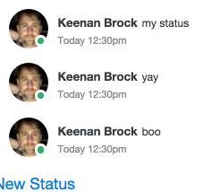

# Rollcall

An exploration in group behavior and technology.

# STORY

A new guy in town walks into the local small town bar and orders his pint.

>A guy call out "5" and the whole bar laughes together.

A few minutes later...

>An old burly fellow calls out "18,"
>to which his wife says "3" and crows erupts in laughter.

Perplexed, the new guy looks to the bartender.

>Bartender, what's up with the numbers?
>
>You see, these people have known each other for a long time.
>They've heard each other's jokes so many times, that they have numbered them.

# RESPONSE

#### This reminds me of our status emails:

> I'm out of the office at X. 
> I'm off to the Doctors

#### And our standups:

> I was in meetings yesterday
>I also was filling out my performance report, corporate form
>Wait, who is next? Is Joe going to be on the call today? 

# GOAL

Lets remove all that noise.

### Get a list of people who are on the call
  - remember who said they are not available
  - remember managers (so they can be skipped?)
  - remember who is in the office (and on a group call) and who is individual

### Give suggestions how to speak
  - Give a list of common responses
  - Give a formula / cheat sheet to help organize thoughts
  - Give suggestions like "Instead of I worked on BZ, I did X for BZ Y"

### Give a place to state you are blocked

### Give a forum for being out of the office

# IMPLEMENTATION

The last thing we need is another "inbox" and process.

So I'm not sure the final interface for this yet, whether email, web, gitter, irc, calendar.
But we do have a list of people on the call, so maybe this will end up living there.

# TECH thoughts

- web sockets
- background jobs
- gitter/irc chat, email, google calendar, cli
- background proceses
- statistics of throughput and performance (though this will probably never hit that)

